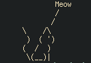

<p align="center">
  
</p>

## About the project
Ever wanted to quote a cat's wisdom but couldn't? now you can.

## Requirements
None, this is good 'ol C.

## Usage

Build from source with
``` sh
make all
```

and Run
``` c
wisecat Meow
```
## TODOs
features to implement in the future, you can also suggest a feature through filing an issue.
- [] Add Multiple cats to chose from.
- [] The ability for users to provide their own ascii art instead of hardcoded ones.


## License
This is distributed under the MIT license, check LICENSE.txt.
